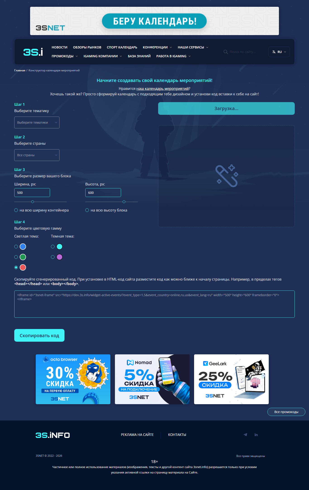
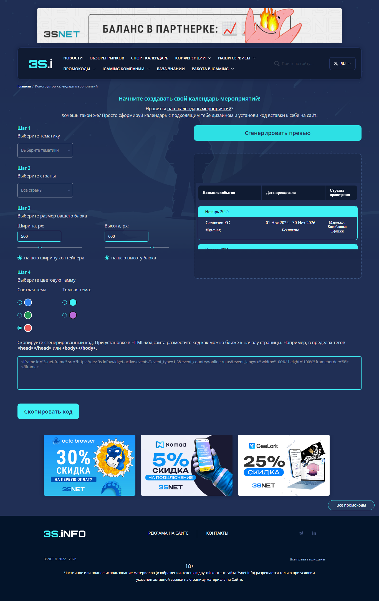
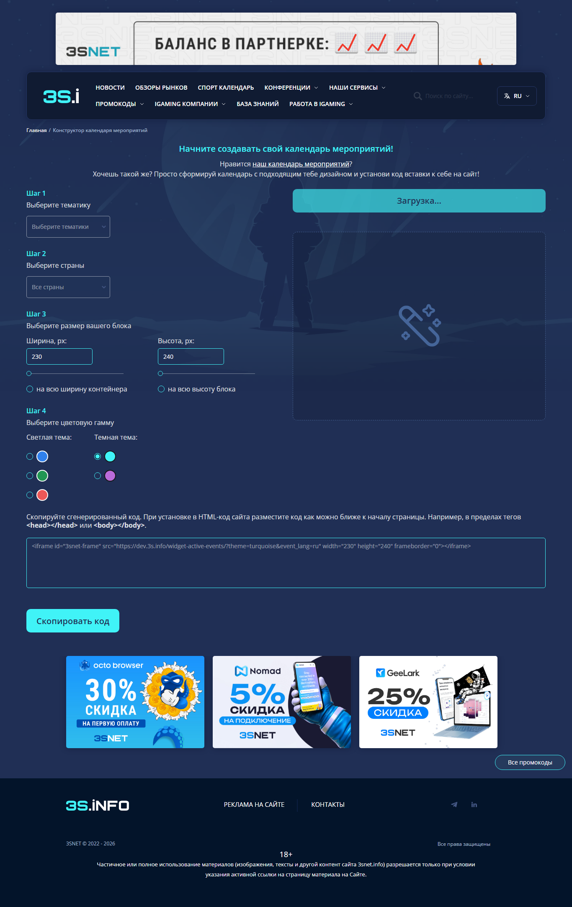
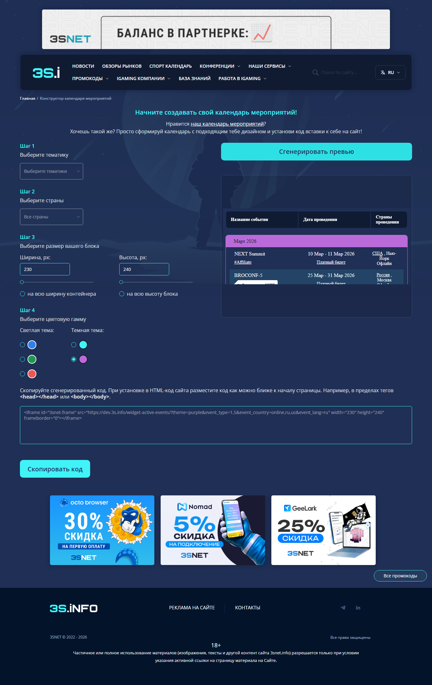
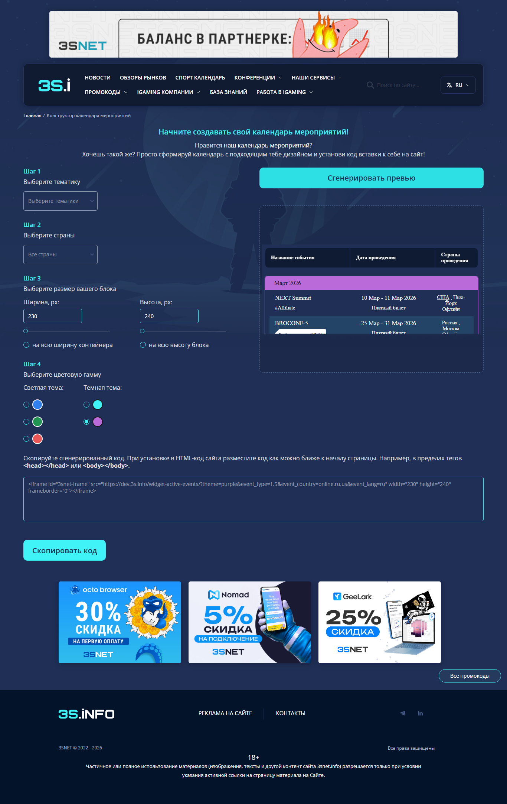
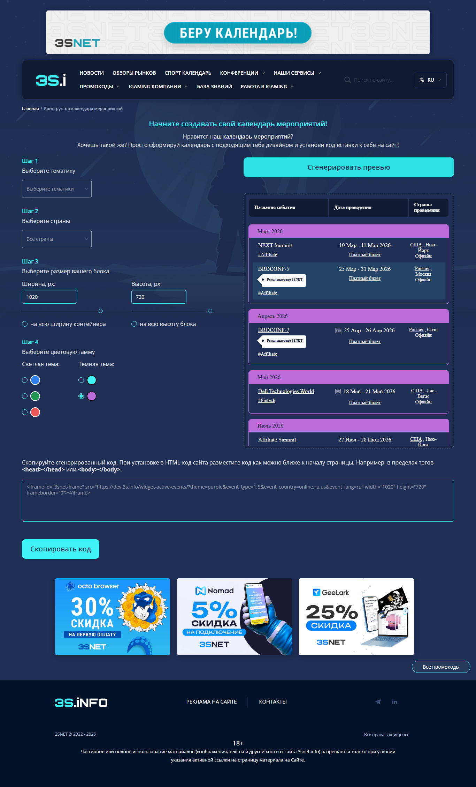
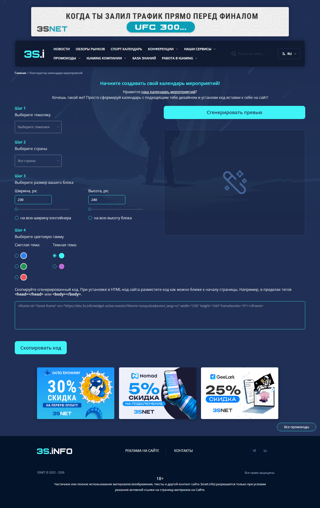
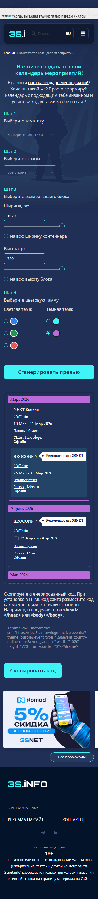
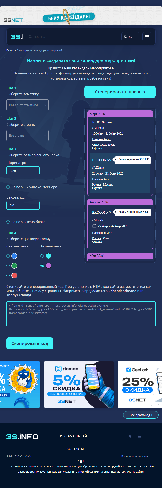
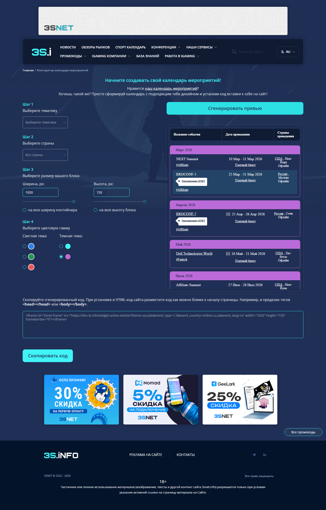

# QA-отчет: Events Widget

## Объект тестирования

Страница конструктора календаря мероприятий:

https://dev.3s.info/eventswidget/

Основная функциональность страницы: пользователь выбирает тематики, страны,
размеры и цветовую тему, после чего получает preview и embed-код iframe для
вставки виджета на свой сайт.

## Цель тестирования

Проверить, что конструктор корректно генерирует preview и embed-код для
ключевых пользовательских сценариев, включая обязательный сценарий выбора
красной темы.

Дополнительно проверить UX/UI, адаптивность, browser console, network requests
и несколько edge cases.

## Окружение

- OS: Windows
- Browser: Chromium-based browser
- Test approach: manual exploratory testing through browser
- Tested URL: `https://dev.3s.info/eventswidget/`
- Viewports:
  - Desktop: `1366x900`, `1440x900`
  - Tablet: `768x1024`
  - Mobile: `375x812`
- Date: 2026-06-11
- Test artifacts: screenshots in `screenshots/`
- Helper script: `tools/collect_diagnostics.py`

## Подход и ограничения

Тестирование выполнено вручную через браузер с использованием исследовательского подхода.

AI использовался как помощник для структурирования результатов, генерации идей
для edge cases и оформления отчета.

Вспомогательный Playwright-скрипт использовался для сбора диагностической
информации: скриншотов, ошибок консоли и неуспешных сетевых запросов. Скрипт
не выполняет автоматический поиск дефектов и не генерирует отчет.

Все указанные дефекты были подтверждены фактической проверкой страницы вручную.

Данный отчет является демонстрационной версией в рамках тестового задания, поэтому объем артефактов ограничен:

- не более 8 баг-репортов;
- 10-15 пунктов чек-листа;
- 8-12 тест-кейсов;
- не более 5 рекомендаций;
- только наиболее значимые edge cases.

Цель отчета - показать качество анализа и приоритизацию, а не максимальное
количество найденных замечаний.

## Проверенные сценарии

- Открытие страницы конструктора.
- Генерация preview с настройками по умолчанию.
- Выбор красной цветовой темы и проверка `theme` в embed-коде.
- Выбор нескольких тематик: `Affiliate`, `Fintech`.
- Выбор нескольких стран: `Россия`, `США`, `Онлайн`.
- Установка размера `500x600`.
- Включение `на всю ширину контейнера` и `на всю высоту блока`.
- Повторная генерация preview после изменения настроек.
- Проверка embed-кода и фактического iframe preview.
- Проверка desktop/tablet/mobile viewport.
- Сбор console warnings и failed network requests.
- Edge cases для отрицательных, текстовых и очень больших значений ширины/высоты.

## Найденные проблемы и особенности

Основные риски связаны с генерацией embed-кода и синхронизацией preview:

- Красная тема не попадает в embed-код как `theme=red`.
- Preview после изменения настроек может оставаться со старым `src`.
- Preview визуально не всегда соответствует атрибутам iframe из embed-кода.
- Некорректные значения размеров обрабатываются молча, без понятной валидации.
- В console есть Mixed Content warnings.
- В network есть failed request к Google Analytics.

## Баг-репорты

### BUG-001. Красная тема не передается в embed-код

Severity: Critical

Priority: High

Environment: Chromium-based browser, Windows, viewport `1366x900`

Preconditions:

- Открыта страница `https://dev.3s.info/eventswidget/`.

Steps to reproduce:

1. Открыть страницу конструктора.
2. В блоке выбора цветовой темы выбрать красную тему.
3. Нажать `Сгенерировать превью`.
4. Проверить значение `src` в сгенерированном embed-коде.

Actual result:

В embed-коде отсутствует параметр `theme=red`.

Пример фактически полученного embed-кода:

```html
<iframe
  id="3snet-frame"
  src="https://dev.3s.info/widget-active-events/?event_type=1,5&event_country=online,ru,us&event_lang=ru"
  width="500"
  height="600"
  frameborder="0"
></iframe>
```

Expected result:

Embed-код должен содержать корректный параметр красной темы, например `theme=red`.

Attachments:

- screenshot: 
- screenshot: 

Comment:

Это ключевой бизнес-сценарий конструктора. Пользователь может скопировать код, который не соответствует выбранной теме.

### BUG-002. Preview не обновляется после изменения настроек

Severity: Major

Priority: High

Environment: Chromium-based browser, Windows, viewport `1366x900`

Preconditions:

- Preview уже был сгенерирован с настройками по умолчанию.

Steps to reproduce:

1. Сгенерировать preview с настройками по умолчанию.
2. Выбрать тематики `Affiliate`, `Fintech`.
3. Выбрать страны `Россия`, `США`, `Онлайн`.
4. Установить размер `500x600`.
5. Выбрать красную тему.
6. Нажать `Сгенерировать превью`.
7. Сравнить `src` iframe в preview и `src` в embed-коде.

Actual result:

Embed-код обновился, но preview iframe остался со старым `src`:

- embed-code `src`: `https://dev.3s.info/widget-active-events/?event_type=1,5&event_country=online,ru,us&event_lang=ru`
- preview iframe `src`: `https://dev.3s.info/widget-active-events/?theme=turquoise&event_lang=ru`

Expected result:

Preview должен пересоздаваться и полностью соответствовать текущему embed-коду.

Attachments:

- screenshot: 

Comment:

Пользователь видит preview не тех настроек, которые собирается копировать.

### BUG-003. Preview не отображает выбранную ширину iframe

Severity: Major

Priority: Medium

Environment: Chromium-based browser, Windows, viewport `1366x900`

Preconditions:

- Открыта страница конструктора.

Steps to reproduce:

1. Оставить настройки по умолчанию.
2. Нажать `Сгенерировать превью`.
3. Проверить embed-код.
4. Проверить фактическую ширину iframe в preview.

Actual result:

Embed-код содержит `width="230"`, но iframe в preview рендерится шириной около `592px`.

Expected result:

Preview должен отображать виджет в той же ширине, которая указана в embed-коде,
или UI должен явно объяснять, что preview растягивается в рамках контейнера.

Attachments:

- screenshot: 

Comment:

Preview вводит пользователя в заблуждение при выборе размеров.

### BUG-004. Некорректные значения ширины/высоты обрабатываются без понятной валидации

Severity: Minor

Priority: Medium

Environment: Chromium-based browser, Windows, viewport `1366x900`

Preconditions:

- Открыта страница конструктора.

Steps to reproduce:

1. Ввести `-1` в поле ширины.
2. Ввести `-1` в поле высоты.
3. Нажать `Сгенерировать превью`.
4. Повторить с текстовыми значениями `abc` и `xyz`.

Actual result:

Некорректные значения молча заменяются на дефолтные `230x240`. Пользователь не
получает сообщения, почему введенное значение не применилось.

Expected result:

Форма должна явно показать ошибку валидации или подсказку о допустимом диапазоне значений.

Attachments:

- screenshot: 
- screenshot: 

Comment:

Поведение технически защищает embed-код от совсем некорректных значений, но UX остается неочевидным.

### BUG-005. Очень большие значения размеров молча ограничиваются

Severity: Minor

Priority: Low

Environment: Chromium-based browser, Windows, viewport `1366x900`

Preconditions:

- Открыта страница конструктора.

Steps to reproduce:

1. Ввести `99999` в поле ширины.
2. Ввести `99999` в поле высоты.
3. Нажать `Сгенерировать превью`.
4. Проверить embed-код.

Actual result:

Embed-код генерируется с ограниченными значениями `width="1020"` и `height="720"`, но пользователь не видит объяснения ограничения.

Expected result:

UI должен показывать допустимый диапазон или сообщение, что значение было приведено к максимуму.

Attachments:

- screenshot: 

Comment:

Это не ломает генерацию, но снижает предсказуемость конструктора.

### BUG-006. В console есть Mixed Content warnings по изображениям

Severity: Minor

Priority: Medium

Environment: Chromium-based browser, Windows, viewport `1366x900`

Preconditions:

- Открыта страница `https://dev.3s.info/eventswidget/`.

Steps to reproduce:

1. Открыть страницу.
2. Открыть browser console или собрать console messages через Playwright.
3. Проверить warnings.

Actual result:

В console зафиксированы Mixed Content warnings. HTTPS-страница запрашивает
изображения через `http://dev.3s.info/...`, браузер автоматически апгрейдит
запросы до HTTPS.

Expected result:

Все ресурсы на HTTPS-странице должны подключаться по HTTPS без Mixed Content warnings.

Attachments:

- screenshot: 

Comment:

Сейчас браузер автоматически исправляет загрузку, но предупреждения ухудшают
техническое качество страницы и могут стать проблемой при более строгих
политиках безопасности.

### BUG-007. Failed request к Google Analytics

Severity: Trivial

Priority: Low

Environment: Chromium-based browser, Windows, viewport `1366x900`

Preconditions:

- Открыта страница конструктора.

Steps to reproduce:

1. Открыть страницу.
2. Собрать failed network requests через Playwright или DevTools Network.
3. Проверить запросы к внешним сервисам.

Actual result:

Зафиксирован failed request:

```text
POST https://www.google-analytics.com/g/collect
net::ERR_ABORTED
```

Expected result:

Критичные для страницы запросы должны завершаться успешно. Для аналитики
допустимо учитывать блокировки окружения, но failed request должен быть
проверен.

Attachments:

- screenshot: 

Comment:

Отмечено как низкий риск, потому что это аналитика и запрос может зависеть от окружения.

## UX/UI-анализ

- Конструктор в целом понятен: шаги расположены последовательно, есть отдельный блок embed-кода.
- Состояние preview после генерации не всегда понятно: в некоторых сценариях справа остается `Загрузка...`, при этом embed-код уже обновлен.
- Для числовых полей нет явной подсказки с допустимым диапазоном.
- При автоматическом приведении значений пользователь не получает обратную связь.
- Кнопка копирования дает понятное состояние `Скопировано`.

## Проверка адаптивности

Проверены viewports:

- Desktop `1440x900`: критичных проблем layout не зафиксировано.
- Tablet `768x1024`: основные блоки доступны, критичных наложений не зафиксировано.
- Mobile `375x812`: страница остается доступной, критичных overlap и горизонтального overflow в проверенном состоянии не зафиксировано.

Attachments:

- screenshot: 
- screenshot: 
- screenshot: 

## Console / Network анализ

Console:

- Зафиксированы Mixed Content warnings по изображениям:
  - `http://dev.3s.info/uploads/media/e7/c5/6f/9700.jpg`
  - `http://dev.3s.info/uploads/media/ce/be/9c/9460.jpg`
  - `http://dev.3s.info/uploads/media/35/0c/b6/9047.jpg`

Network:

- HTTP 4xx/5xx responses в рамках прогона не зафиксированы.
- Failed request:
  - `POST https://www.google-analytics.com/g/collect`
  - failure: `net::ERR_ABORTED`

## Edge cases

### Edge case 1. Отрицательные значения размеров

Input: `width=-1`, `height=-1`

Result: значения не попали в embed-код, были заменены на `230x240`, но без сообщения пользователю.

Attachment: 

### Edge case 2. Текст вместо чисел

Input: `width=abc`, `height=xyz`

Result: значения не попали в embed-код, были заменены на `230x240`, но без сообщения пользователю.

Attachment: 

### Edge case 3. Очень большие значения

Input: `width=99999`, `height=99999`

Result: embed-код был ограничен до `1020x720`, но без объяснения в UI.

Attachment: 

## Предложения по улучшению

1. Исправить маппинг красной темы, чтобы embed-код всегда содержал `theme=red`.
2. Пересоздавать preview iframe после каждой генерации и синхронизировать его `src`, `width`, `height` с embed-кодом.
3. Добавить видимую валидацию для полей ширины и высоты с указанием допустимого диапазона.
4. Исправить HTTP-ссылки на изображения на HTTPS, чтобы убрать Mixed Content warnings.
5. Добавить smoke/autotest на генерацию embed-кода для всех цветовых тем.

## Итоговое заключение

Страница конструктора в целом доступна и позволяет сформировать embed-код, но
ключевой сценарий с красной темой работает некорректно: параметр `theme=red` не
передается в итоговый код.

Дополнительно preview не всегда синхронизируется с новым embed-кодом после
изменения настроек. Эти дефекты стоит исправить до использования конструктора
как надежного инструмента для пользователей.
